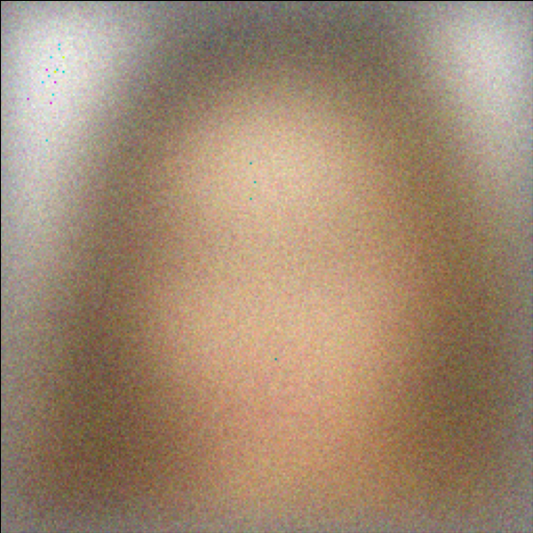
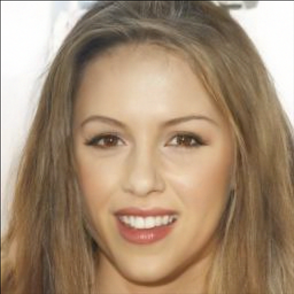
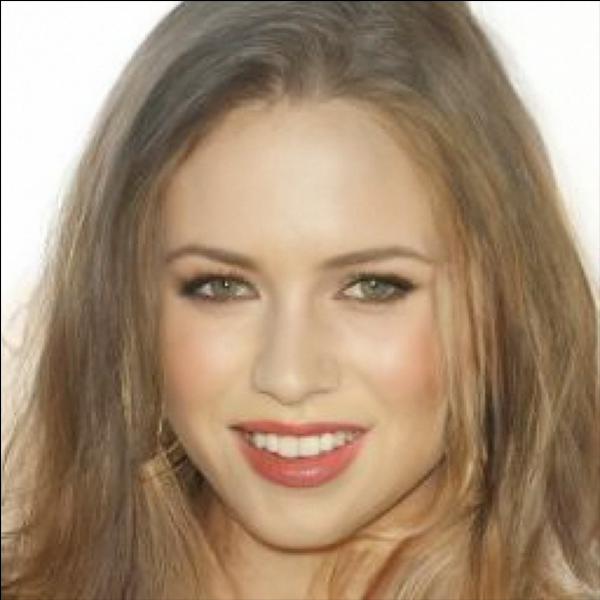
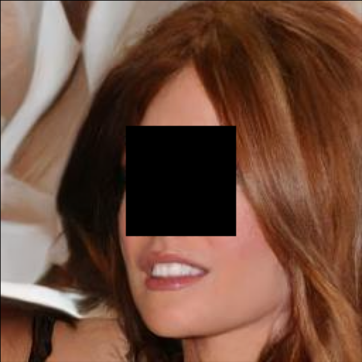
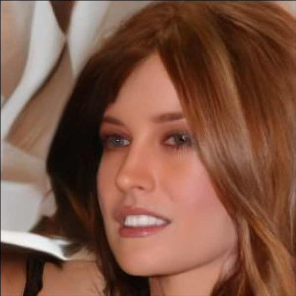
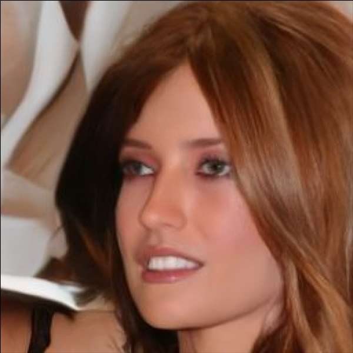
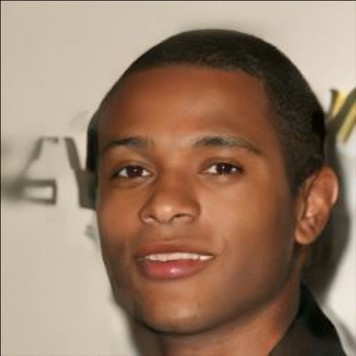

# MCG-Diff: Monte Carlo guided diffusion for Bayesian linear inverse problems

This repository contains the code of the algorithm proposed in https://arxiv.org/abs/2308.07983 and accepted for oral presentation at ICLR 2024.

This repository can be installed as a python package by running
`pip install -I .` on the root folder of this git.

You can try this algorithm either with the available scripts in this project or in the benchopts, with comparison to other algorithms at https://github.com/gabrielvc/benchopts_inverse_problem_diffusion_prior/tree/master

## Results using the hugging face models on CelebA

The following table was produced by running the `scripts/hugging_faces_models.py` with the configurations described below.
The configuration for MCG DIFF is defined in `scripts/configs/mcg_diff/default.yaml`. Running this script took 3 minutes to generate each image, but
this can be made faster by using parallelization.

| Original image                       | Observation | Sample | Sample | Changes to `config.yaml`         |
|--------------------------------------| ---- | ---- | ---- |----------------------------------|
|      | | | | `seed = 32`, `task = deblur_2d`  |
|  | | | | `seed = 15`, `task = inpainting` |
|  | | | | `seed = 10`, `task = sr`         |
